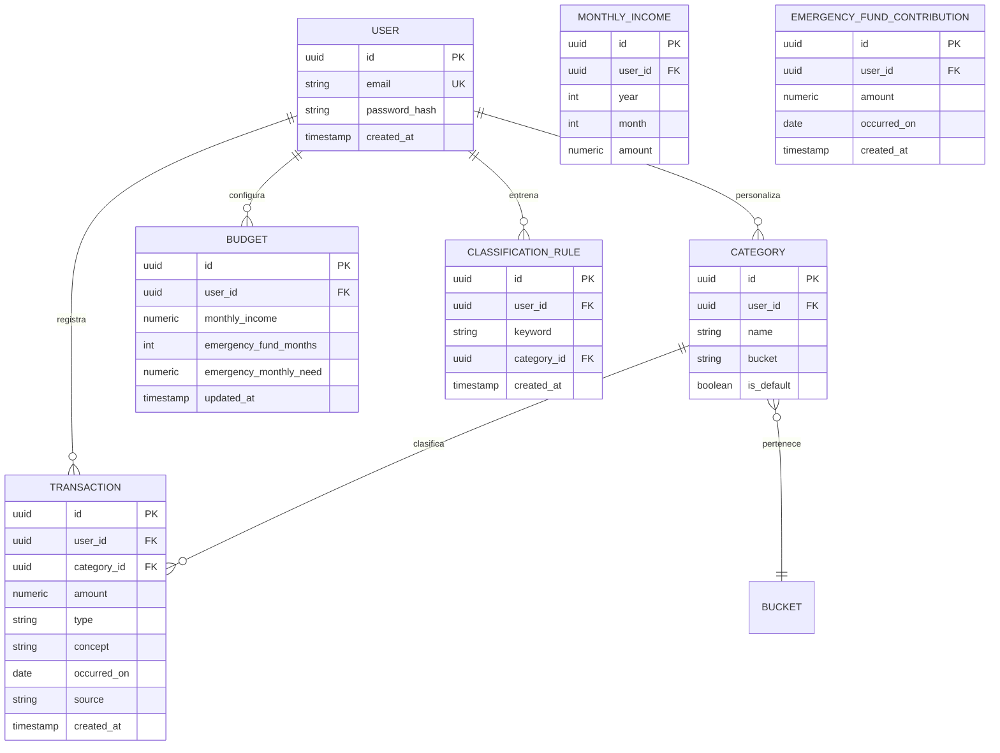

# Modelo de datos (Entidad-Relación)

## Diagrama ER

## Descripción de entidades

### USER
Usuario de la aplicación. `email` único, contraseña siempre hasheada
(`password_hash`), nunca en claro.

### TRANSACTION
Movimiento de dinero.
- `amount`: **NUMERIC/Decimal**, nunca float (RNF-06). Siempre positivo; el
  signo lo determina `type`.
- `type`: `income` (entrada) | `expense` (salida).
- `concept`: texto libre del concepto (lo que viene del banco o escribe el
  usuario). Es la base para la clasificación automática.
- `occurred_on`: fecha real del movimiento (para el análisis mensual).
- `source`: `manual` | `import_csv` | `import_xls` (trazabilidad del origen).

### CATEGORY
Categoría de clasificación. Cada categoría pertenece a un **bucket** de la regla
50-30-20:
- `living` (50% — gastos de vida)
- `monthly` (30% — gastos del mes)
- `investment` (20% — inversión)
- `income` (ingresos, no cuenta como gasto)

Se siembran categorías por defecto (`is_default = true`) y el usuario puede
crear las suyas.

### BUDGET
Configuración financiera del usuario (una fila por usuario).
- `monthly_income`: **ingreso habitual por defecto**; se usa como base del reparto
  50-30-20 en los meses que no tengan un ingreso propio en `MONTHLY_INCOME`.
- `emergency_fund_months`: meses objetivo del colchón (3–6).
- `emergency_monthly_need`: gasto mensual para dimensionar el colchón; si es NULL
  se usa `monthly_income` (el ingreso habitual).
- Los porcentajes del reparto (Vida/Mes/Inversión) son configurables y deben sumar 100.

### MONTHLY_INCOME
Ingreso de un **(usuario, año, mes)** concreto. El ingreso mensual **no es fijo**:
cada mes puede tener su propio importe (te ascienden, te despiden, un mes con
extra…). Único por `(user_id, year, month)`. Los meses sin fila caen en el
`monthly_income` habitual de `BUDGET`. En la vista de año, el ingreso base del
reparto es la **suma de los 12 meses** (ya no `monthly_income × 12`).

### EMERGENCY_FUND_CONTRIBUTION
Aportación al **colchón de emergencia** (US-20). El colchón es una caja de ahorro
virtual: cada fila es un importe con su fecha (`occurred_on`). No son movimientos
(`transactions`), por eso no computan en ingresos/gastos/neto ni en el 50-30-20.
El **objetivo** = `BUDGET.monthly_income` (ingreso habitual) × `emergency_fund_months`
(3–6), y el progreso es la suma de las aportaciones.

### CLASSIFICATION_RULE
Regla aprendida del feedback del usuario. Si un `keyword` (p. ej. "Mercadona")
aparece en el concepto, se asigna la `category_id` asociada. Alimenta el motor
de reglas y reduce las llamadas a IA con el tiempo (US-14).

## Categorías semilla por defecto (propuesta)

| Bucket      | Categorías |
| ----------- | ---------- |
| living      | Vivienda, Suministros, Alimentación, Transporte, Salud, Seguros |
| monthly     | Restauración, Ocio, Ropa, Suscripciones, Caprichos |
| investment  | Fondos, Acciones, Cripto, Ahorro/Colchón |
| income      | Nómina, Extra, Reembolsos |

## Notas de implementación

- Claves primarias `uuid` para evitar enumeración de recursos (seguridad).
- Índices previstos: `transaction(user_id, occurred_on)` para el análisis
  mensual; `classification_rule(user_id, keyword)` para la clasificación.
- Borrado de usuario en cascada sobre sus entidades dependientes.
